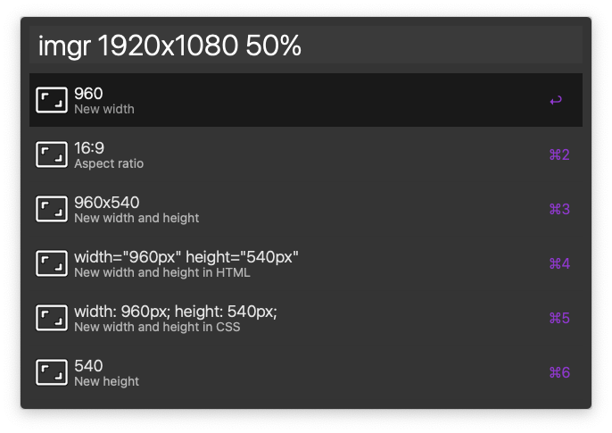

# Image size calculator workflow for Alfred

## Table of Contents

- [About](#about)
- [Getting Started](#getting_started)
- [Usage](#usage)

## About 

Calculate new width and height for a resolution and keep aspect ratio. Input resolution and then change in either percent (e.g. 50% is half size, 200% is double size) or input the new width in pixels. The choose result is pasted to the front most application and copied to the clipboard.

Also shows the aspect ratio for the currect resolution, e.g. 16:9, 4:3 etc.

Supports Alfred text actions, so you can select HTML or CSS code and invoke Alfred text actions, select the new resolution and it will be pasted to the front most application.

## Getting Started 

### Prerequisites

Is using the PHP GNU MP library, [https://www.php.net/manual/en/intro.gmp.php](https://www.php.net/manual/en/intro.gmp.php).

### Installing

Work in progress...

## Usage 

Input resolution in the following formats are supported:

- `[width]x[height]`
- `width: [width]px; height: [height]px;` - CSS format
- `width="[width]px" height="[height]px"` - HTML format

The order of the width and height doesn't matter for CSS and HTML format.

### For example:

- `1920x1080 50%`
- `width: 1920px; height: 1080px; 50%`
- `height: 1080px; width: 1920px; 50%`
- `width="1920px" height="1080px" 50%`
- `height="1080px" width="1920px" 50%`

End with the change in either percent or a new width, e.g
`1920x1080 50%` if you want half the resolution or `1920x1080 200%` if you want double the resolution.

### Outputs the new resolution in the following formats:

- Aspect ratio, e.g. `16:9`, `4:3` etc.
- New width and height, `960x540`
- New width and height in HTML, `width="960px" height="540px"`
- New width and height in CSS, `width: 960px; height: 540px;`
- New width, `960`
- New height, `540`

